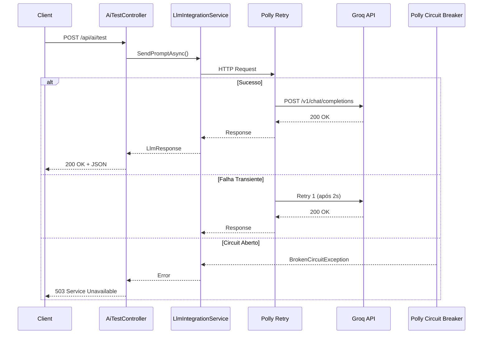

# 🏗️ Arquitetura LLM Integration - Nível Sênior

## 📋 Visão Geral

Implementação enterprise-grade de integração com Groq API (Llama-4) seguindo padrões .NET modernos e práticas de resiliência.

---

## 🎯 Princípios Aplicados

### **1. Separation of Concerns**
- **Controller Layer**: Validação de entrada e orquestração (`AiTestController`)
- **Service Layer**: Lógica de negócio e integração HTTP (`LlmIntegrationService`)
- **Configuration Layer**: Tipagem forte e validação (`LlmConfiguration`)
- **DTO Layer**: Contratos de entrada/saída (`LlmRequest`, `LlmResponse`)

### **2. Dependency Injection**
```csharp
// Interface segregation
public interface ILlmIntegrationService
{
	Task<LlmResponse> SendPromptAsync(LlmRequest request);
	Task<bool> ValidateConnectionAsync();
}

// Registro com HttpClient Factory
builder.Services.AddHttpClient<ILlmIntegrationService, LlmIntegrationService>()
	.AddPolicyHandler(GetRetryPolicy())
	.AddPolicyHandler(GetCircuitBreakerPolicy());
```

### **3. Resilience Patterns (Polly)**

#### **Retry Policy**
```csharp
- Estratégia: Exponential Backoff
- Tentativas: 3 (2s, 4s, 8s)
- Casos: Falhas transientes HTTP (5xx, timeouts)
- Rate Limiting: Detecta 429 (Too Many Requests)
```

#### **Circuit Breaker**
```csharp
- Limite: 5 falhas consecutivas
- Tempo aberto: 30 segundos
- Estados: Closed → Open → Half-Open → Closed
- Proteção: Evita sobrecarga da API externa
```

### **4. Configuration Management**

#### **Hierarquia de Configuração**
```
1. appsettings.json (defaults públicos)
2. Secret Manager (credenciais locais)
3. Environment Variables (produção)
4. Azure Key Vault (cloud seguro)
```

#### **Validação em Startup**
```csharp
builder.Services.AddOptions<LlmConfiguration>()
	.ValidateDataAnnotations()  // [Required], [Range], etc.
	.ValidateOnStart();         // Falha rápido se inválido
```

---

## 📦 Pacotes NuGet Utilizados

| Pacote | Versão | Propósito |
|--------|--------|-----------|
| `Microsoft.Extensions.Http.Polly` | 8.0+ | Retry + Circuit Breaker |
| `Microsoft.Extensions.Options.DataAnnotations` | 8.0+ | Validação de configuração |
| `Microsoft.EntityFrameworkCore.SqlServer` | 10.0+ | Persistência de dados |
| `Scalar.AspNetCore` | Latest | Documentação interativa |

---

## 🔒 Segurança

### **API Key Management**

**❌ Nunca:**
```csharp
// Hardcoded
var apiKey = "YOUR_GROQ_API_KEY_HERE";
```

**✅ Correto:**
```csharp
// Secret Manager (Development)
dotnet user-secrets set "LlmSettings:ApiKey" "gsk_..."

// Environment Variable (Production)
export LlmSettings__ApiKey="gsk_..."

// Azure Key Vault (Cloud)
builder.Configuration.AddAzureKeyVault(...)
```

### **HTTP Headers**
```csharp
client.DefaultRequestHeaders.Add("Authorization", $"Bearer {apiKey}");
client.DefaultRequestHeaders.Add("User-Agent", "AgilePredict/1.0");
```

---

## 📊 Observabilidade

### **Logging Strategy**

```csharp
// Retry logs
[Retry] Tentativa 1 de 3 após 2s. Razão: RequestTimeout

// Circuit Breaker logs
[Circuit Breaker] ⚠️  Circuito ABERTO por 30s. Razão: ServiceUnavailable
[Circuit Breaker] 🔄 Circuito MEIO-ABERTO. Testando recuperação...
[Circuit Breaker] ✅ Circuito FECHADO. Requisições normalizadas.
```

### **Métricas Recomendadas**
- Taxa de sucesso/falha da API
- Latência média de requisições
- Contagem de retries/circuit breaks
- Tokens consumidos por período

---

## 🧪 Testabilidade

### **Unit Tests**
```csharp
// Mock do ILlmIntegrationService
var mockService = new Mock<ILlmIntegrationService>();
mockService
	.Setup(s => s.SendPromptAsync(It.IsAny<LlmRequest>()))
	.ReturnsAsync(new LlmResponse { Success = true });
```

### **Integration Tests**
```csharp
// WebApplicationFactory com configuração de teste
var factory = new WebApplicationFactory<Program>()
	.WithWebHostBuilder(builder =>
	{
		builder.ConfigureAppConfiguration((context, config) =>
		{
			config.AddInMemoryCollection(new Dictionary<string, string>
			{
				["LlmSettings:ApiKey"] = "test-key"
			});
		});
	});
```

---

## 🚀 Performance

### **HttpClient Lifetime**
```csharp
.SetHandlerLifetime(TimeSpan.FromMinutes(5))
```
- Evita socket exhaustion
- Respeita DNS TTL
- Balance entre conexão pooling e atualização

### **Timeout Configuration**
```csharp
client.Timeout = TimeSpan.FromSeconds(30);  // Timeout global
```
- Groq API: ~1-5s para Llama-4
- Margem: 30s para cenários complexos
- Circuit Breaker: Protege contra timeouts em cascata

---

## 📁 Estrutura de Arquivos

```
AgilePredict/
├── Controllers/
│   └── AiTestController.cs           # Endpoints de teste
├── Services/
│   ├── Interfaces/
│   │   └── ILlmIntegrationService.cs  # Contrato do serviço
│   └── LlmIntegrationService.cs       # Implementação
├── Models/
│   ├── Configuration/
│   │   └── LlmConfiguration.cs        # Configuração tipada
│   └── DTOs/
│       ├── LlmRequest.cs              # Payload de entrada
│       └── LlmResponse.cs             # Payload de saída
├── Program.cs                         # DI + Middleware + Polly
└── appsettings.json                   # Configurações públicas
```

---

## 🔄 Fluxo de Requisição



---

## 📚 Referências

- [Polly Documentation](https://www.pollydocs.org/)
- [HttpClient Factory Best Practices](https://learn.microsoft.com/en-us/dotnet/architecture/microservices/implement-resilient-applications/use-httpclientfactory-to-implement-resilient-http-requests)
- [Secret Manager (.NET)](https://learn.microsoft.com/en-us/aspnet/core/security/app-secrets)
- [Groq API Documentation](https://console.groq.com/docs)

---

## 🎓 Conceitos Avançados

### **1. Transient Fault Handling**
```csharp
HttpPolicyExtensions.HandleTransientHttpError()
// Detecta:
// - HttpRequestException (network failures)
// - 5xx status codes (server errors)
// - 408 Request Timeout
```

### **2. Bulkhead Isolation**
```csharp
// Futura implementação (opcional)
.AddPolicyHandler(Policy.BulkheadAsync<HttpResponseMessage>(
	maxParallelization: 10,
	maxQueuingActions: 20))
```

### **3. Timeout Strategy**
```csharp
// Policy timeout (mais granular que HttpClient.Timeout)
.AddPolicyHandler(Policy.TimeoutAsync<HttpResponseMessage>(
	TimeSpan.FromSeconds(10)))
```

---

**Autor:** AgilePredict Team  
**Última Atualização:** 2026-01-10  
**Versão:** 1.0.0
